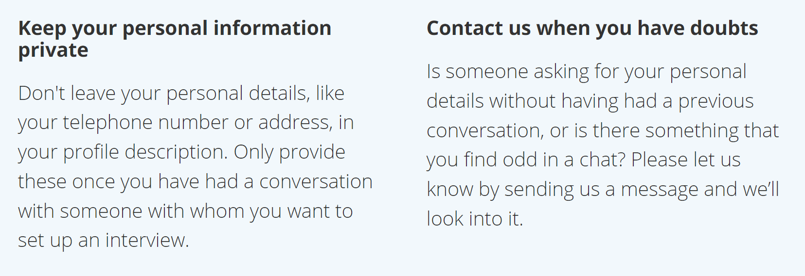

# WELCOME TO NANNY´S HUB

## 1. Let us know what you're looking for.

Enter your preferences and needs into your profile. Think about experience, availability, or babysitting rate. You will see the babysitters and nannies who fit your situation best. You can change the filters at any time.

# 2. View nanny profiles.

Check the profiles to get to know the babysitters / nannies and view their experience, references, and skills. See if what they offer matches what you are seeking in a babysitter or a nanny and send message the ones that you like.

# 3. Meet the babysitters and nannies you like.

If Nanny accept your booking proposal, you can set up an interview and get to know them even better. See how they are with your kids and decide if it is a match for your family.

# Safety matters

